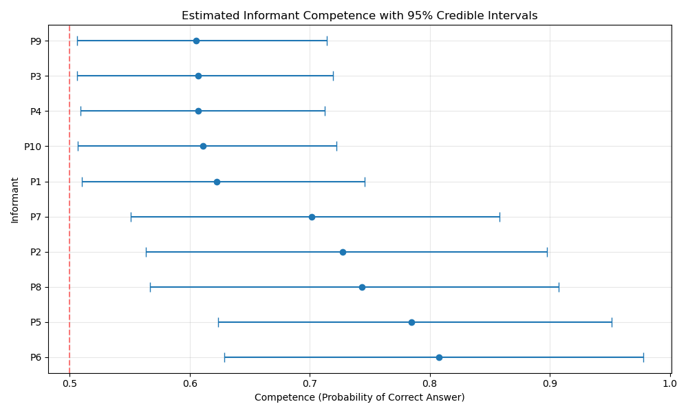

### Table of contents
- [Report](#report)
<!-- - [Selection of the prior distributions](#selection-of-the-prior-distributions) -->
- [Introduction to the CCT model](#introduction-to-the-cct-model)
- [Results](#results)

# Report
<!-- ### Selection of the prior distributions -->
I chose the Beta distribution (scaled to [0.5, 1]) to represent the prior knowledge of the informants. This better aligns with the CCT assumptions that cultural knowledge is not distributed evenly across the population but instead that most people have moderate competence levels. This offers us more flexibility to encode varying degrees of knowledge. 
  
The Bernoulli(0.5) distribution represents to the prior probability of each item's consensus answer. This represents the uncertainty of the answer before data is observed. This allows the model to learn new data.
  
The MCMC sampling shows high convergence (1.0000) using 4 chains, 2000 draws per chain, and 1000 tuning steps. The sampling performance is high with around 320 draws/second and taking 9 seconds in total to complete.

**Trial 1**                       
| Chain | Progress | Draws | Divergences | Step size | Grad evals | Speed (draws/s) | Elapsed | Remaining |
|-------|----------|-------|-------------|-----------|------------|-----------------|---------|-----------|
| 1 | ✓ | 3000 | 0 | 0.66 | 7 | 321.82 | 0:00:09 | 0:00:00 |
| 2 | ✓ | 3000 | 0 | 0.78 | 3 | 323.36 | 0:00:09 | 0:00:00 |
| 3 | ✓ | 3000 | 0 | 0.59 | 7 | 320.55 | 0:00:09 | 0:00:00 |
| 4 | ✓ | 3000 | 0 | 0.51 | 7 | 319.30 | 0:00:09 | 0:00:00 |
            
  

**Trial 2**  
Informant Competence Estimates:
- Most competent: P6 (0.809)
- Least competent: P9 (0.604)
- Average competence: 0.682

Consensus Answer Estimates:
- Items where CCT and majority vote agree: 15 of 20
Items where CCT and majority vote disagree:
  * Item 8: CCT says Yes (p=0.88), Majority says No
  * Item 10: CCT says Yes (p=0.87), Majority says No
  * Item 6: CCT says Yes (p=0.83), Majority says No
  * Item 14: CCT says Yes (p=0.72), Majority says No
  * Item 2: CCT says Yes (p=0.60), Majority says No

Convergence Diagnostics:
- R-hat values should be close to 1.0 (< 1.05 is good)
- Min R-hat: 1.0000, Max R-hat: 1.0000
- Effective sample sizes (ESS) should be large relative to actual samples
- Min ESS: 2911.0

*Figure 1: Estimated informant competence with 95% credible intervals*

*Figure 2: Probability of consensus answer being 'Yes' for each item, with disagreements with majority vote highlighted in red*

*Figure 3: Posterior probability distributions of competence values for each informant*

*Figure 4: Posterior probability distributions of consensus answers for each item*

# Introduction to the CCT model
The Cultural Consensus Theory (CCT) is a model represents how knowledge is distributed across a population. We are not given the correct answer in advance and do not know who the experts are. Rather, it's based on the agreed answer that most people give. 

$$
p_{ij} = Z_j \cdot D_i + (1 - Z_j) \cdot (1 - D_i)
$$

- Each person is given a knowledge score before 50% (guessing) to 100% (expert). 
- Each question is formatted as a binary answer (Yes/No) with a true answer (i.e. the actual answer) that most knowledgeable person would give
- The likelihood of a correct answer is a function of the person's knowledge score
- The answer with the largest majority is assumed to be correct (consensus answer)